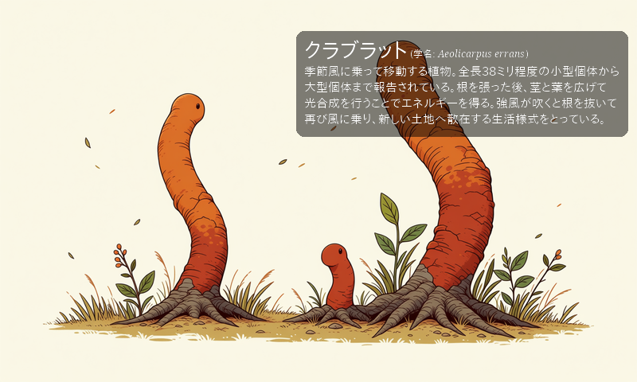
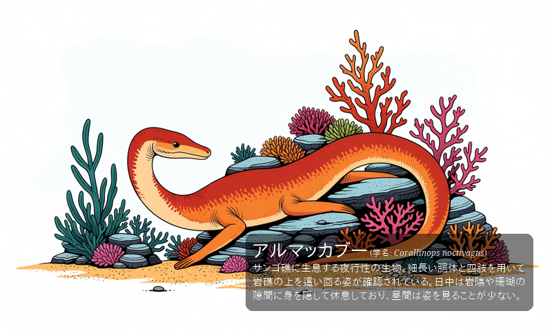
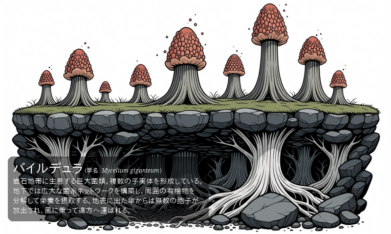
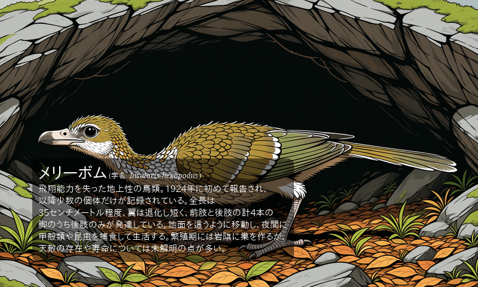
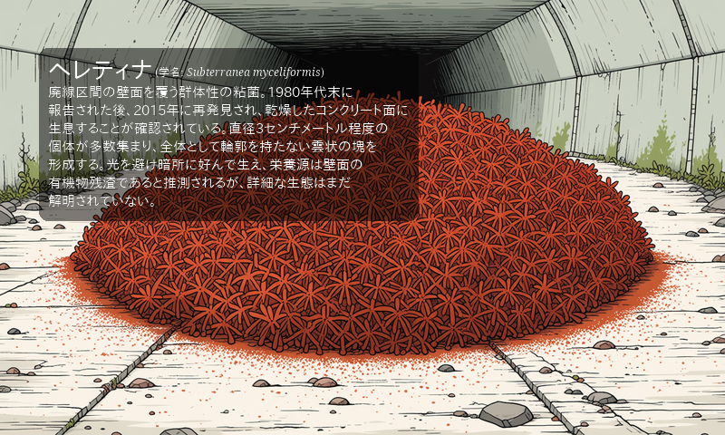
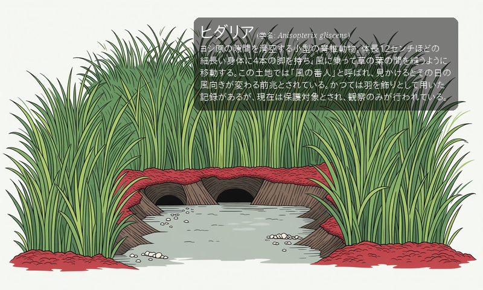
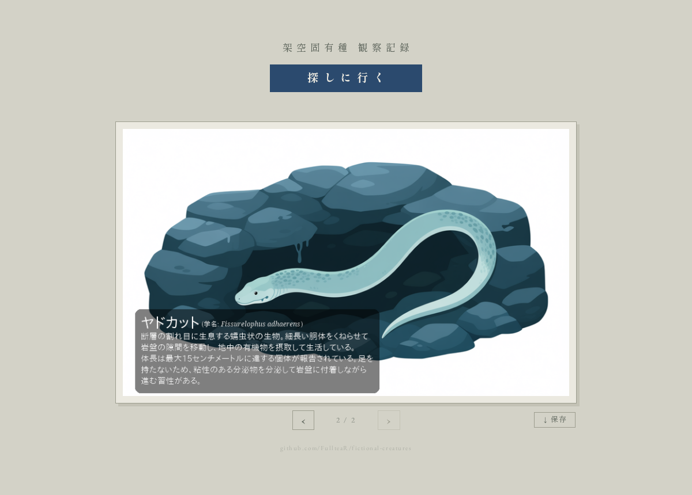

# fictional-creatures

Generates field-guide cards for fictional endemic creatures. Each card combines a katakana name
from a Markov chain, a Japanese description and a Latin scientific name written by a local LLM
(Qwen3.8-27B on llama.cpp), and a plate drawn by the Anima image model through ComfyUI.

## Samples

<p>






</p>

## Web UI

One button and the card it turns up. Press 探しに行く and a new card is generated; the cards made
earlier in the session are turned back to with ‹ and ›, and ↓ 保存 saves the one on screen.



## Running

An NVIDIA GPU with 24GB of VRAM is required.

```bash
docker compose up
```

| URL | |
|-----|---|
| http://localhost:28081 | Web UI |
| http://localhost:28080 | JupyterLab — open `src/monster-generator.ipynb` |
| http://localhost:8188 | ComfyUI |

The LLM is downloaded on first start. The image model weights are not, and go under
`models/comfyui/`:

| Path | File | Source |
|------|------|--------|
| `diffusion_models/` | `novaAnimeAM_v40.safetensors` | [Civitai: Nova Anime AM](https://civitai.com/models/2604424) |
| `text_encoders/` | `qwen_3_06b_base.safetensors` | [HF: circlestone-labs/Anima](https://huggingface.co/circlestone-labs/Anima) |
| `vae/` | `qwen_image_vae.safetensors` | same HF repo |

Generated cards are saved to `src/endemic/`.
